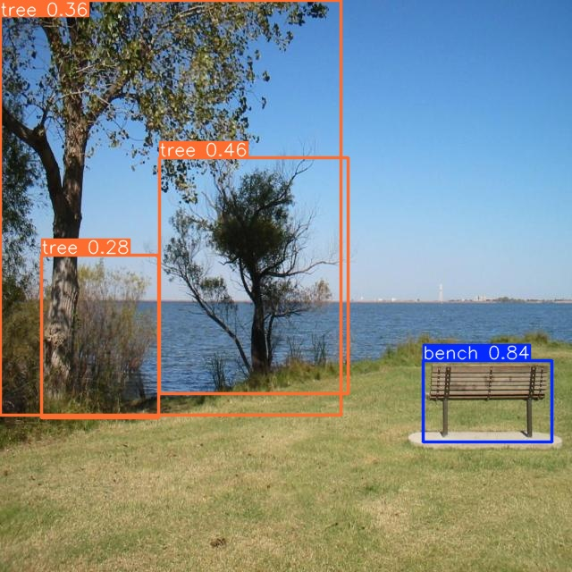

## 1. Introduction
We are sharing in this repository the training, evaluation, and deployment scripts for well-known lightweight object detection models, applied to a custom dataset designed to identify 22 objects commonly found on sidewalks. This is intended to assist blind and visually impaired people (BVIP). Our primary aim is to investigate the feasibility of deploying computationally intensive deep learning models on resource-constrained IoT devices. Secondly, we aim to create a portable, low-cost, and real-time assistive tool for the visually impaired.

## 2. Training Scripts

See the YOLOv5-v8 Docs and tensorflow 2 object detection api tutorials for full documentation on training, testing and deployment.

To Train, Validate and Test YOLOv5 models please refer to: [](https://colab.research.google.com/drive/1S2KgiI8kLQBoTxLyKhkGCroyUbCRJZQ4?usp=sharing)

To Train, Validate and Test YOLOv8 models please refer to: [](https://colab.research.google.com/drive/1PBzMQ34aG5m-WZEF8O49ghhxS6r_XhTv?usp=sharing)

To Train, Validate and Test TFLite 2 models (efichientdet-d1, ssd mobilenet fpnlite, faster rcnn resnet50 v1) please refer to : [](https://colab.research.google.com/drive/1I4lcX26STG4OrNsgEzjwA3XNIRD8Qrq0?usp=sharing)

## 3. Deploy on Raspberry Pi 
<details>
<summary>Update the Raspberry Pi</summary>

On a termonal run the command to update the Raspberry Pi:
```
sudo apt-get update
sudo apt-get dist-upgrade
```

Then, enable the camera interface on raspberry-pi:
```
sudo raspi-config
```
Select the Interfaces tab and Enable the camera interface. and reboot the Raspberry Pi.

</details>

<details>
<summary>Download this repository and create virtual environment</summary>

Tap the command to clone this repository:

```
git clone https://github.com/lamao-ab/object-detection-in-iot-devices.git
```

rename the folder to "wkspace" and then enter into it:

```
mv object-detection-in-iot-devices wkspace
cd wkspace
```

Install virtualenv :

```
sudo pip install virtualenv
```

Then, create and activate the "wkspace-env" virtual environment, which will contain all the package libraries for this environment:

```
python -m venv wkspace-env
```

```
source wkspace-env/bin/activate
```
</summary>
</details>

### 3.1 Pytorch models

<details>
<summary>yolov5</summary>
  
Install ultralytics pip package
```
cd wkspace
pip install ultralytics
```

Clone repo and install requirements.txt.

```
git clone https://github.com/ultralytics/yolov5  
cd yolov5
pip install -r requirements.txt 
```
Run Inference   
``` 
python detect.py --data /home/pi/wkspace/SOD-2/data.yaml --source /home/pi/wkspace/SOD-2/test/images/ --weights /home/pi/wkspace/custom_models/yolov5n.pt  --imgsz 640 --conf 0.25
```

Predict on webcam:
```
# set source=0 to start inference on webcam
python detect.py --weights /home/pi/wkspace/custom_models/yolov5n.pt --source 0
```

Detection results with yolov5n custom model are stored at: /home/pi/wkspace/yolov5/runs/detect/exp/


</details>

<details>
<summary>yolov8</summary>

Install ultralytics </summary>  
```
pip install ultralytics==8.0.20
pip install --upgrade ultralytics
```

Run Inference>

```
yolo task=detect mode=predict source= /home/pi/wkspace/SOD-2/test/images/  model=/home/pi/wkspace/custom_models/yolov8n.pt data=/home/pi/wkspace/SOD-2/data.yaml imgsz=640 conf=0.25 save=True 
```
Detection results with yolov8 custom model are stored at: /home/pi/wkspace/runs/detect/predict/



Predict on webcam::

```
#set source=0 to start inference on webcam
yolo predict model=/home/pi/wkspace/custom_models/yolov8s.pt source=0
```


</details>


### 3.1 TensorFlow Lite models

<details>
<summary>Install TensorFlow Lite dependencies and OpenCV</summary>
  
```
pip install tensorflow opencv-python protobuf==3.20.*
# pyttsx3 is a text-to-speech conversion library in Python
pip install pyttsx3
```
</details>

<details>
<summary>Run the TensorFlow Lite model</summary>
Run the real-time webcam detection script by executing the following command from inside the /home/pi/wkspace directory.
demo is a folder that contain the model file and label classes file. 
  
```
python detection_webcam_voice.py --modeldir=custom_models
```

```
python detection_image_voice.py --modeldir=custom_models --image=dark.jpg
python detection_image_voice.py --modeldir=custom_models --image=enhanced-dark.jpg

```
</details>

## 4. low light image enhancement module

This script is a python implementation [6] of Nighttime low illumination image enhancement with single image using bright/dark channel prior [Paper](https://jivp-eurasipjournals.springeropen.com/articles/10.1186/s13640-018-0251-4).
https://github.com/spmallick/learnopencv/tree/master/Improving-Illumination-in-Night-Time-Images/python

<details>
<summary>Install dependencies and run image enhacement script</summary>
  
```
pip install numpy opencv-contrib-python
```

```
python low_light_img_enhancement.py
```
</details>

## References

- [1] https://github.com/ultralytics/ultralytics
- [2] https://github.com/ultralytics/yolov5
- [3] https://www.tensorflow.org/lite/guide/python
- [4] https://github.com/tensorflow/tensorflow/tree/master/tensorflow/lite/examples/python
- [5] https://colab.research.google.com/github/EdjeElectronics/TensorFlow-Lite-Object-Detection-on-Android-and-Raspberry-Pi/blob/master/Train_TFLite2_Object_Detction_Model.ipynb
- [6] https://github.com/spmallick/learnopencv/tree/master/Improving-Illumination-in-Night-Time-Images/python


